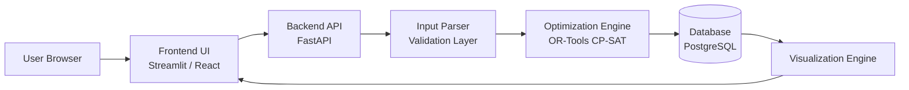
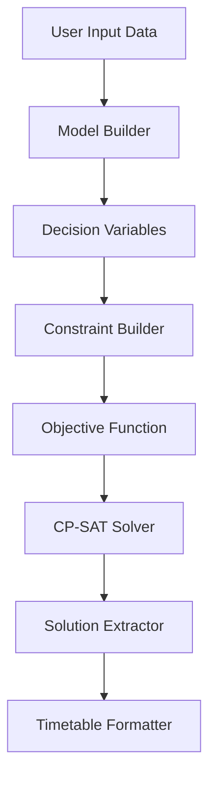
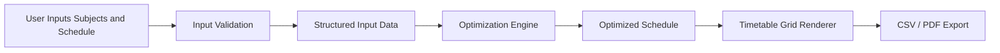
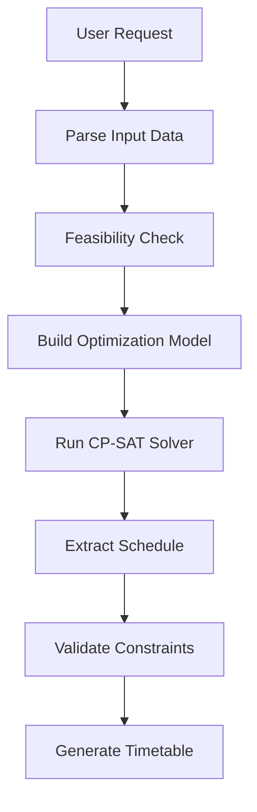

# System Architecture

This document describes the system architecture of the **Smart Timetable Generator**, an optimization-based scheduling system built using constraint programming.

The system is designed to demonstrate:

- Operational Research modeling
- Constraint optimization
- Modular system design
- Scalable SaaS architecture

---

# 1. High-Level Architecture

This diagram shows the overall product architecture.



2. Optimization Engine Architecture

The optimization engine is responsible for building and solving the scheduling model.


3. Data Flow Architecture

This diagram explains how data moves through the system from user input to final timetable output.


4. Scalable SaaS Architecture

The system can be extended into a scalable SaaS platform using asynchronous job processing.

```mermaid
User[Users]

Frontend[Frontend<br>Next.js]

Gateway[API Gateway]

Backend[FastAPI Service]

Queue[Task Queue<br>Redis]

Worker[Solver Workers<br>OR-Tools]

DB[(PostgreSQL)]

Storage[(Object Storage)]

User --> Frontend
Frontend --> Gateway
Gateway --> Backend
Backend --> Queue
Queue --> Worker
Worker --> DB
DB --> Backend
Backend --> Frontend
Backend --> Storage

```

5. Solver Execution Pipeline

This diagram shows the internal workflow of the optimization process.


